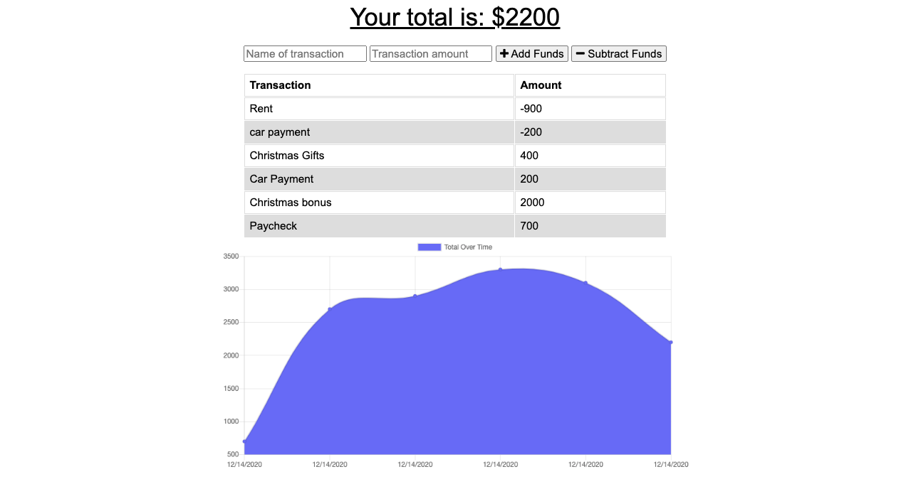

# Budget Tracker

## About this Project
Users want to check their budget and spending habits quickly and easily accessible. This budget tracking tool provides a simple interface to do just that. Not only can you access it anywhere on the web you can also access this with out internet. If you need a shortcut, you can download it to your deskop, or even your mobile device. 

## Tech Used

- MongoDB
- Express.js
- Node.js
- Service Workers
- Compression

## Installation & Usage
Clone this repo and then in your terminal type `npm install` to install all of the needed dependences. After which in your terminal type `npm start` to launch the application. 

## Deployed Application

[Budget Tracking App](https://frozen-mesa-37887.herokuapp.com/)

## Images

Here is the Budget Dashboard

